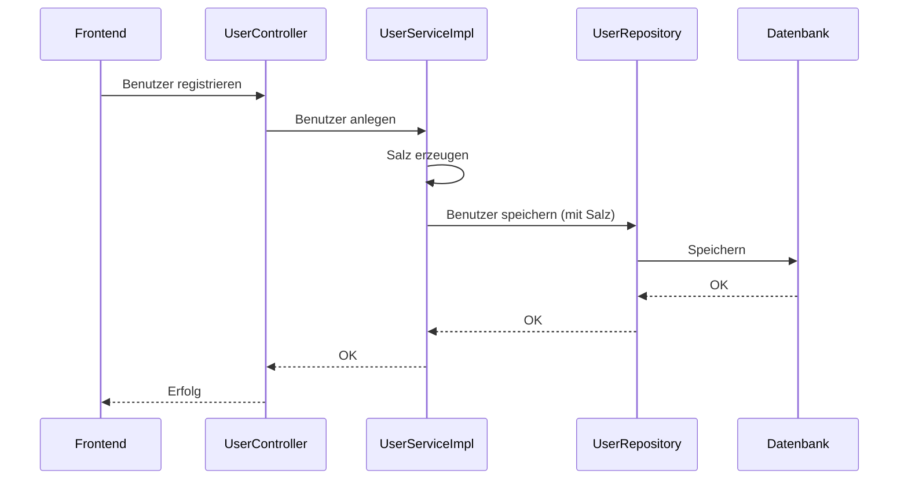
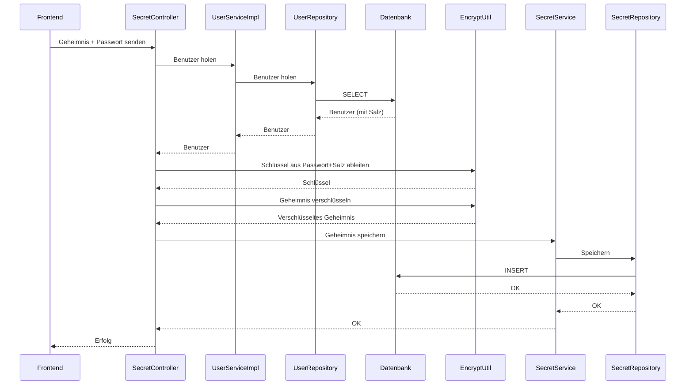
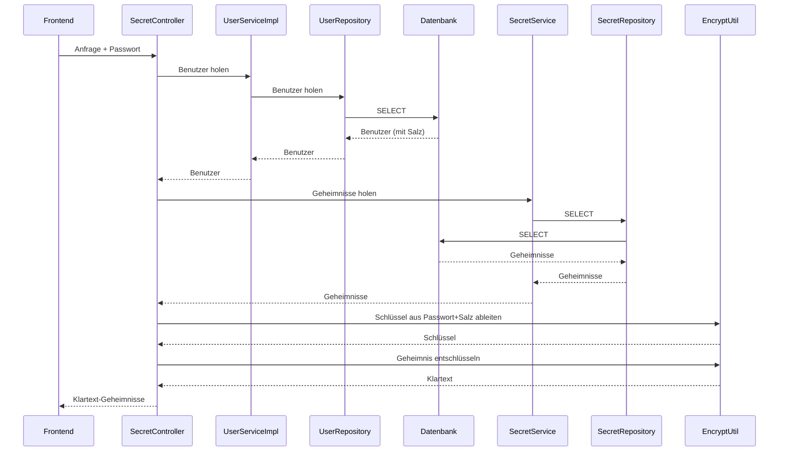

**Backend-Änderungen:**

1. **User.java (Benutzer-Entity):**
   - Neues Feld `salt` (String) für jeden Benutzer. Dieses Salz wird für die Verschlüsselung der Geheimnisse genutzt (nicht für das Passwort-Login!).

2. **UserServiceImpl.java (Service):**
   - Beim Anlegen eines neuen Benutzers wird ein sicheres, zufälliges Salz (16 Byte, Base64-kodiert) erzeugt und gespeichert.

3. **EncryptUtil.java (Verschlüsselungs-Helfer):**
   - Der Konstruktor nimmt jetzt zwei Werte: das Passwort und das Salz.
   - Die Ableitung des Schlüssels erfolgt jetzt mit PBKDF2WithHmacSHA256 (viel sicherer als vorher!).

4. **SecretController.java (Controller):**
   - Vor jeder Verschlüsselung/Entschlüsselung wird das Salz des Benutzers aus der Datenbank geholt und an `EncryptUtil` übergeben.
   - Es gibt Prüfungen, ob Benutzer und Salz vorhanden sind.

5. **UserController.java (Controller):**
   - Benutzer werden jetzt mit dem Standard-Konstruktor erstellt und die Felder einzeln gesetzt. Das Salz wird erst im Service erzeugt.

---

## 2. Wie wurde es gemacht?

### 2.1. Salz-Erzeugung und Speicherung

- In der User-Entity gibt es jetzt:

```java
@Column(nullable = true)
private String salt;
```

- Im Service wird beim Anlegen eines Benutzers das Salz erzeugt:

```java
SecureRandom random = new SecureRandom();
byte[] saltBytes = new byte[16];
random.nextBytes(saltBytes);
user.setSalt(Base64.getEncoder().encodeToString(saltBytes));
```

**Erklärung:** Jeder neue Benutzer bekommt ein eigenes, zufälliges Salz. Das macht die Verschlüsselung viel sicherer.

### 2.2. Schlüssel-Ableitung mit PBKDF2

- Der Konstruktor von `EncryptUtil` sieht jetzt so aus:

```java
public EncryptUtil(String secretPassword, String saltString) {
    byte[] salt = Base64.getDecoder().decode(saltString);
    SecretKeyFactory factory = SecretKeyFactory.getInstance("PBKDF2WithHmacSHA256");
    KeySpec spec = new PBEKeySpec(secretPassword.toCharArray(), salt, 65536, 256);
    SecretKeySpec generatedSecretKey = new SecretKeySpec(factory.generateSecret(spec).getEncoded(), "AES");
    this.secretKeySpec = generatedSecretKey;
}
```

**Erklärung:** Das Passwort und das Salz werden mit PBKDF2 zu einem starken AES-Schlüssel gemacht. Das schützt vor Angreifern.

### 2.3. Verwendung des Salzes im Controller

- Vor dem Verschlüsseln/Holen eines Geheimnisses wird das Salz des Benutzers geladen und an `EncryptUtil` übergeben:

```java
User user = userService.findByEmail(newSecret.getEmail());
if (user == null || user.getSalt() == null) {
    // Fehlerbehandlung
}
EncryptUtil util = new EncryptUtil(newSecret.getEncryptPassword(), user.getSalt());
```

### 2.4. Benutzer-Erstellung

- Benutzer werden jetzt so erstellt:

```java
User user = new User();
user.setFirstName(...);
user.setLastName(...);
user.setEmail(...);
user.setPassword(...);
// Das Salz wird im Service gesetzt!
```

---

## 3. Ablauf: Wie funktioniert das jetzt?

### Benutzer-Registrierung
1. Frontend schickt Registrierungsdaten.
2. Backend erzeugt ein Salz und speichert es mit dem Benutzer.

### Geheimnis anlegen
1. Frontend schickt Geheimnis + Passwort.
2. Backend holt das Salz des Benutzers.
3. Mit Passwort + Salz wird ein Schlüssel erzeugt und das Geheimnis verschlüsselt.

### Geheimnis lesen
1. Frontend schickt Anfrage + Passwort.
2. Backend holt das Salz des Benutzers.
3. Mit Passwort + Salz wird der Schlüssel erzeugt und das Geheimnis entschlüsselt.

---

## 4. Was ist mit alten Benutzern?

- Benutzer, die **vor** dieser Änderung angelegt wurden, haben **kein Salz**. Für sie funktioniert die neue Verschlüsselung nicht.
- Lösung: Benutzer neu anlegen **oder** ein Admin-Skript schreiben, das für alte Benutzer ein Salz erzeugt (Achtung: Alte Geheimnisse bleiben unlesbar, wenn sie nicht migriert werden!).

---

## 5. Ablaufdiagramme (Mermaid)

### Registrierung


### Geheimnis anlegen


### Geheimnis lesen


---

**Fazit:**
- Jeder Benutzer hat jetzt ein eigenes Salz für die Verschlüsselung seiner Geheimnisse.

